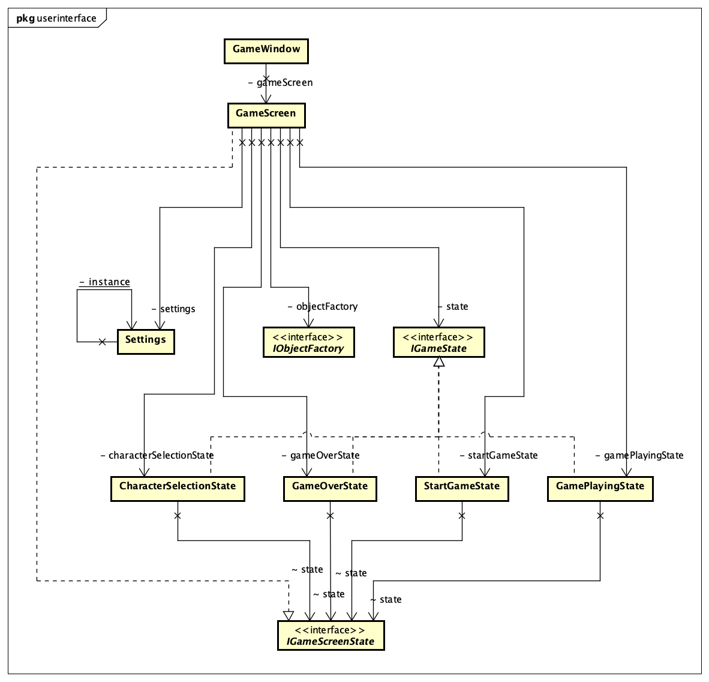
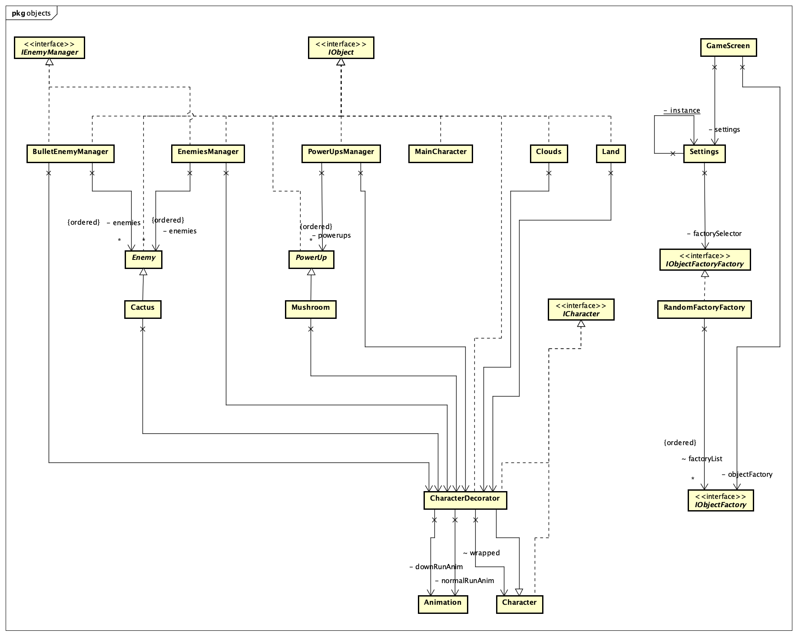
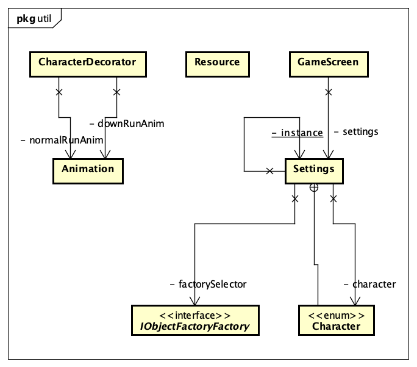
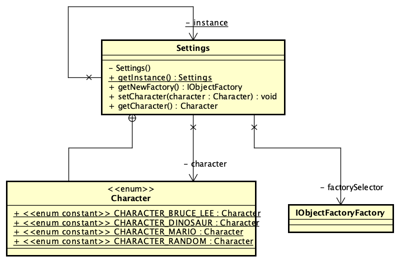

# Chrome Dino  
### [Watch Trailer](https://www.youtube.com/watch?v=9khZpnRMiHk)
### [Recorded Demo](https://youtu.be/dPIWv86ULjM)
### [Scrum Meeting](https://drive.google.com/file/d/1OCEi2Q5DITIa36W-Lx6bhsV6-yoGj9fV/view?usp=sharing)
Cutting and joining using Adobe Premiere Pro. Sound cleaning(static noise reduction) using Adobe Audition.
### [Link to our work video after scrums](https://drive.google.com/file/d/1Mfdq_JS-9BlWed0IoxLoIsUygwCDtalj/view?usp=sharing)

## Team Name
Water

## Team Members

* [Adarsh Patil](https://github.com/adpatil036)
* [Anujot Singh](https://github.com/tojuna)
* [Rohit K Philip](https://github.com/rohitkphilip)
* [Yash Modi](https://github.com/yashm28sjsu)

## How to run the game
* Install AWT, Swing
* Clone this [repository](https://github.com/nguyensjsu/fa21-202-water)
* Run `GameWindow` inside the userinterface folder

## About Game
Guide the Tyrannosaurus rex across a side-scrolling landscape, avoiding obstacles to achieve a higher score. You can now change your character! Play as Tyrannosaurus rex, Bruce Lee or Mario!

&nbsp;

&nbsp;

## [UI Wireframes](./images/ui-wireframes.png)

## Game Screenshots
#### Main Menu

#### Game Play

#### Game End

### [Project Dashboard](https://github.com/nguyensjsu/fa21-202-water/projects/1)
We tracked issues in project dashboard as:
 * TO-DO
 * IN PROGRESS
 * DONE

### [Burndown Chart](https://docs.google.com/spreadsheets/d/1SoNHd6VdUsYvqtHj7YMbvN_78-oVNKeAV7NsBcfKB68/edit?usp=sharing)

* Task Sheet
  

* Burndown Chart
  
 

### [Retrospective Dashboard](./images/retrospective-dashboard.png)

## Design Notes

### High Level Architecture

-   User Interface Class Diagram

-   Objects Class Diagram

-   Utilities Class Diagram

### State Pattern

-   The state pattern is a behavioral design pattern. According to GoF definition, a state allows an object to alter its behavior when its internal state changes. The object will appear to change its class. State Pattern has been used to transition between the different game playing states. The different states are: GamePlayingState, GameOverState, GameStartState and CharacterSelectionState

### [Decorator](./images/decorator_pattern_class_diagram.png)

-   Decorator is a structural design pattern that lets you attach new behaviors to objects by placing these objects inside special wrapper objects that contain the behaviors.This pattern has been implemented for character selection. The CharacterDecorator class wraps around the classes CharacterBruceLee, CharacterDinosaur and CharacterMario to provide functionalities like jump, draw etc for the main character while the classes for the characters contain the resources for the characters(images).

### Singleton

-   Singleton Pattern is used in settings screen to provide a way to access to the character of the game. To restrict the instantiation of a class to just one single instance so that there should not be mulitple characters in the game at a single time. It is also used to initiate the frame per second rate. This frames per second rate should not be instantiated muliple times in a game as there will be only one frames per second rate in the game. 

### Abstract Factory

-   Abstract Factory Pattern is used to fetch objects of same kind at runtime for different choices of character.
-   For example, for Dinosaur the enemy should be cactus but for Mario the enemy should be Bullet.
-   In this scenario, based on the selected character, we can fetch that corresponding factory to get all the related objects. In other words, when we get Dinosaur, we'll get all corresponding land, clouds, enemies, etc.

### Individual Contributions
* Anujot - State Pattern, User Interface, Graphic Images Creation, Documentation, Demo Video, Agile Video
* Adarsh - Singleton Pattern, Animation Logic, Background Sound, User Story Video
* Rohit - Decorator Pattern, Graphic Images Creation, Util, Character Selection
* Yash -  Abstract Factory Pattern, Diagrams, Connecting components, Characters and Objects

### Team Journals
* [Anujot](https://docs.google.com/document/d/1OtRYFB6AZ2-ywfoYEYmuGZvEknHGLNkGpVMCrY4hjX8/edit)
* [Adarsh](https://docs.google.com/document/d/1QaUme6EvhNVO5APSkX10locUypCL7Xs5x-AKutCLCR4/edit)
* [Rohit](https://docs.google.com/document/d/1mwQLH9er2-xmaUzJfj2jfBJ75LUKVwBZ44Y267klyy8/edit?usp=sharing)
* [Yash](https://docs.google.com/document/d/19b-PiPMiilFd61TAujqmiiGorWQeAdAyjc6aWBsXgiU/edit)
