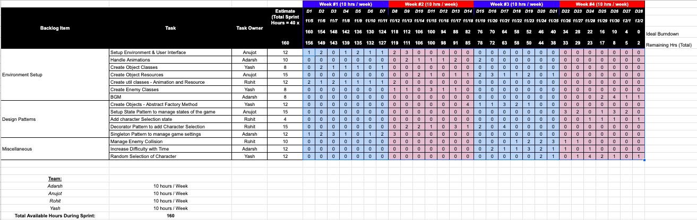
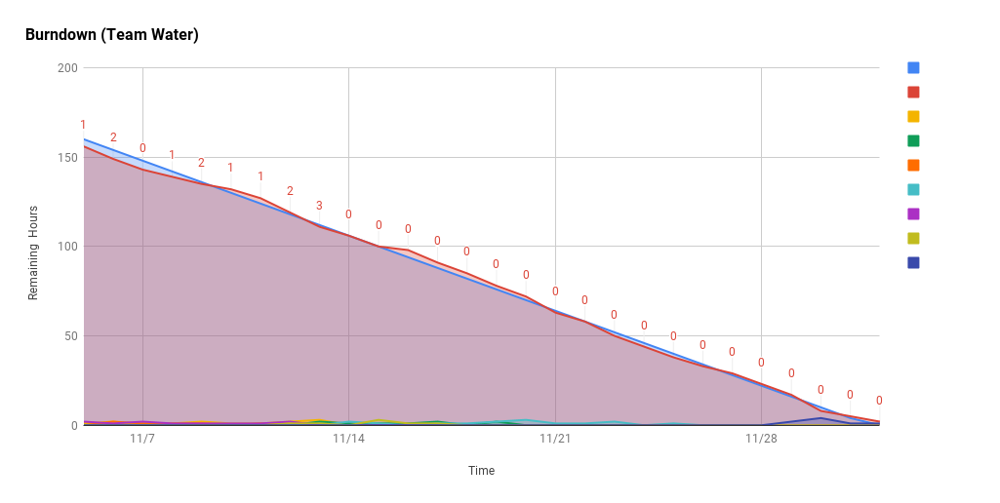
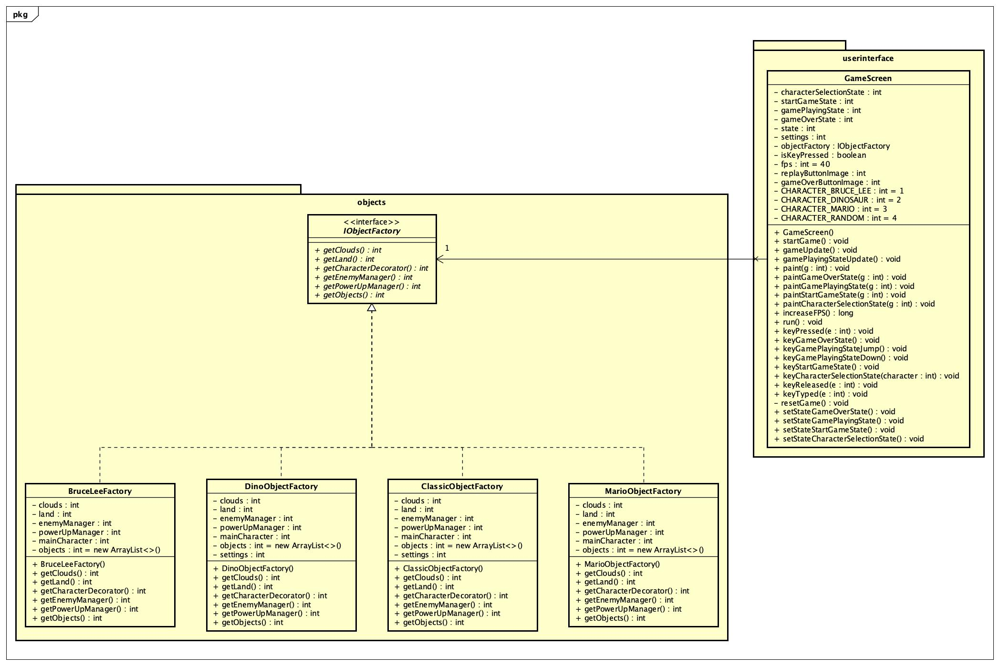

# Chrome Dino [Watch Trailer](https://www.youtube.com/watch?v=9khZpnRMiHk)

## Team Name
Water

## Team Members

* [Adarsh Patil](https://github.com/adpatil036)
* [Anujot Singh](https://github.com/tojuna)
* [Rohit K Philip](https://github.com/rohitkphilip)
* [Yash Modi](https://github.com/yashm28sjsu)

## How to run the game
* Install AWT, Swing
* Clone this [repository](https://github.com/nguyensjsu/fa21-202-water)
* Run `GameWindow` inside the userinterface folder

## About Game
Guide the Tyrannosaurus rex across a side-scrolling landscape, avoiding obstacles to achieve a higher score. You can now change your character! Play as Tyrannosaurus rex, Bruce Lee or Mario!

&nbsp;

&nbsp;

## [UI Wireframes](./images/ui-wireframes.png)

We tracked issues in project dashboard as:
 * TO-DO
 * IN PROGRESS
 * DONE

### [Project Dashboard](https://github.com/nguyensjsu/fa21-202-water/projects/1)

### [Burndown Chart](https://docs.google.com/spreadsheets/d/1SoNHd6VdUsYvqtHj7YMbvN_78-oVNKeAV7NsBcfKB68/edit?usp=sharing)

* Task Sheet
  

* Burndown Chart
  
 

### [Retrospective Dashboard](./images/retrospective-dashboard.png)

## Design Notes

### State Pattern

-   State Pattern been used to transition between states.

### [Decorator](./images/decorator_pattern_class_diagram.png)

Decorator pattern has been implemented for character selection.

### Singleton

### Abstract Factory

-   Abstract Factory Pattern used to fetch a set of objects of same kind in real time

### Individual Contributions
* Anujot - State Pattern, User Interface, Graphic Images Creation, Documentation, Demo Video, Agile Video
* Adarsh - Singleton Pattern, Animation Logic, Background Sound, User Story Video
* Rohit - Decorator Pattern, Graphic Images Creation, Util, Character Selection
* Yash -  Abstract Factory Pattern, Diagrams, Connecting components, Characters and Objects
